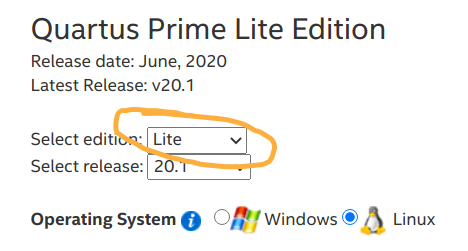
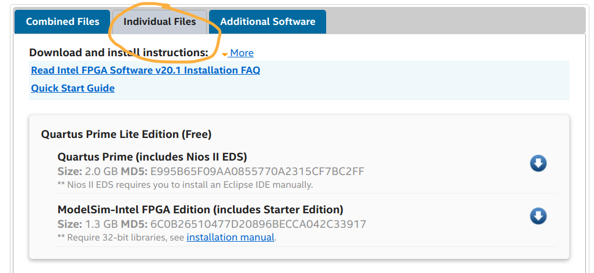

# Episode 1: Hello World

In this episode we get the tools installed and the board powered up.

## Downloading the necessary files
In this section you'll get to download the installation files for the tools
necessary to program Intel FPGAs.

You need to download three files:
* Quartus Prime
* ModelSim-Intel FPGA Edition
* Cyclone V device support

Go to the website
[https://fpgasoftware.intel.com/](https://fpgasoftware.intel.com/) and make
sure you choose "Select edition: Lite", see below. This is the only edition
that is free to use without a license. The other two editions require paid
licenses.



Next you must select "Individual Files", see below:




and then download the three files mentioned above into a temporary directory.

You should now have the following three files:
* cyclonev-20.1.0.711.qdz
* ModelSimSetup-20.1.0.711-linux.run
* QuartusLiteSetup-20.1.0.711-linux.run

## Installing the tools

Now you must make sure the Quartus Lite setup program has execute permissions,
e.g.  by executing in the temporary download folder the following command:

```
chmod a+x *.run
```

Now you're ready to install. Only the Quartus Lite setup program needs to be
run; it will automatically recognize the other two files and install
everything.

```
sudo ./QuartusLiteSetup-20.1.0.711-linux.run
```

Finally, you have to manually set up the paths to quartus. You can do this by adding
the following two lines to your `.bashrc` login script.

```
export QUARTUS_ROOTDIR=/opt/intelFPGA_lite/20.1/quartus
export PATH=$PATH:$QUARTUS_ROOTDIR/bin:$QUARTUS_ROOTDIR/linux64:$QUARTUS_ROOTDIR/../qsys/bin:$QUARTUS_ROOTDIR/sopc_builder/bin:$QUARTUS_ROOTDIR/sopc_builder/model/bin
```


## The design
This first design is trivial, and its purpose is only to get the tools
installed and working.  The DE10 Nano board has 4 slide switches and 8 LEDs. In
this first design, the four slide switches are connected to the first four
LEDs. This is seen in the design file [top.vhd](top.vhd).

## The Makefile
The Quartus tool is controlled by a script file, and is invoked by the command
`quartus_sh`. The command line argument `--flow compile` is an instruction to
build the complete design and generate a bit-file that can be programmed onto
the FPGA.

The Makefile is not really necessary, and you can just as well start the Quartus
tool manually by the following command:

```
quartus_sh --flow compile top
```

## The compile script
The file [top.qsf](top.qsf) contains all the build instructions.

* The `FAMILY` and `DEVICE` tags describe the particular FPGA on the DE10 Nano
  board. You should not change these, as long as you are making designs for
  this board.
* The `TOP_LEVEL_ENTITY` tag is the name of the entity. This should match the
  name defined in the file [top.vhd](top.vhd).
* The `PROJECT_OUTPUT_DIRECTORY` tag is not strictly necessary, but it
  instructs Quartus to place all (well, most of) its output files into a
  subdirectory (which it will create automatically).
* The `NUM_PARALLEL_PROCESSORS` tag is absolutely not necessary, but Quartus
  gives a warning if a value is not specified for this tag.
* The `VHDL_FILE` is used once for each VHDL source file.
* The `SDC_FILE` is not used in this project, but I've included it here since
  otherwise Quartus gives a critical warning.

The remaining lines instructs Quartus on which pins on the FPGA shall be
connected to the ports of the top level entity.

## Testing
To start the build simply type the command:

```
make
```

You will notice a few warnings remaining, like:
* `Warning (292013): Feature LogicLock is only available with a valid
  subscription license. You can purchase a software subscription to gain full
  access to this feature`. I'm not sure what this warning is about, but it seems
  to be safe to ignore it.
* `Warning (332068): No clocks defined in design`. This is very true, as this
  exceptionally simple design has no clocks. This warning will go away already
  in the next episode.


Once the build is finished, you can program the FPGA with the generated bitstream.

Then you should be able to control four of the LEDs using the four slide switches!

